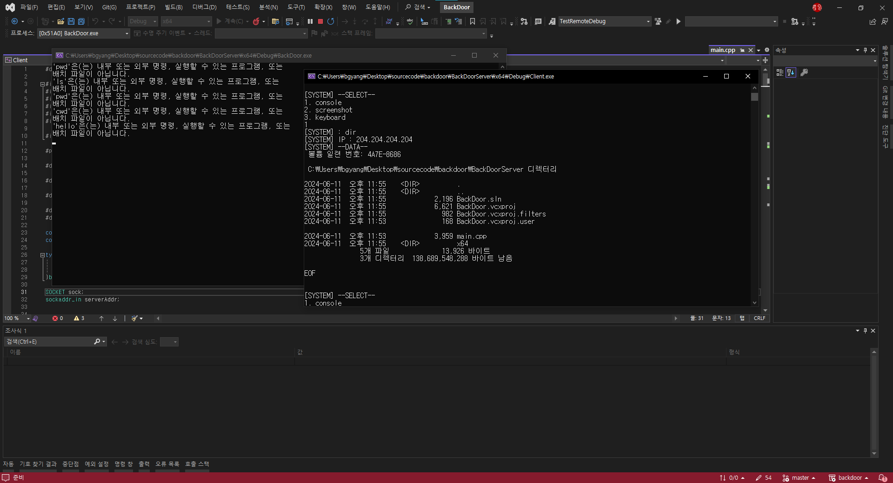
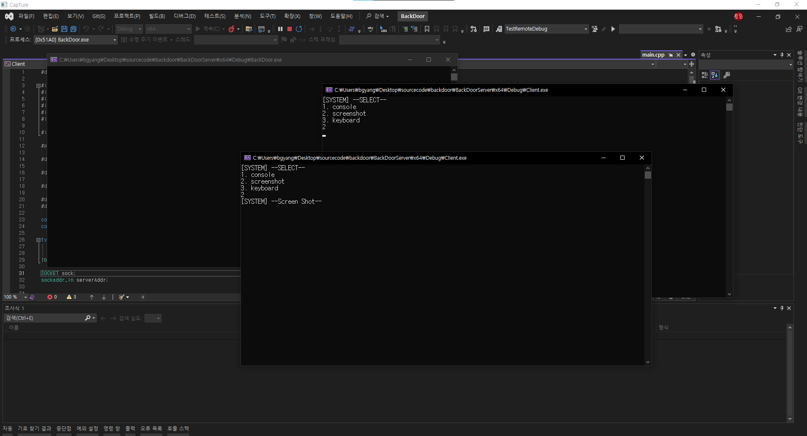

# Backdoor Program
* date : 예전..
* 내용 : 보안 공부 도중 백도어 프로그램 원리/기술 파악 후 구현
* 기술 : Reverse TCP, _popen(), BMP를 이용한 스크린샷 구현 

## Console 기능
_popen (pipe open) 함수를 이용하여, 콘솔 창에 도스 커맨드 전달 및 결과 데이터 클라이언트에게 전달

## Screenshot 기능
win32api bitmap 파일 형식으로 서버 화면 bitmap 데이터로 클라이언트에게 전달

## keyhook 기능
구현 도중 공부가 바빠져서 드랍..